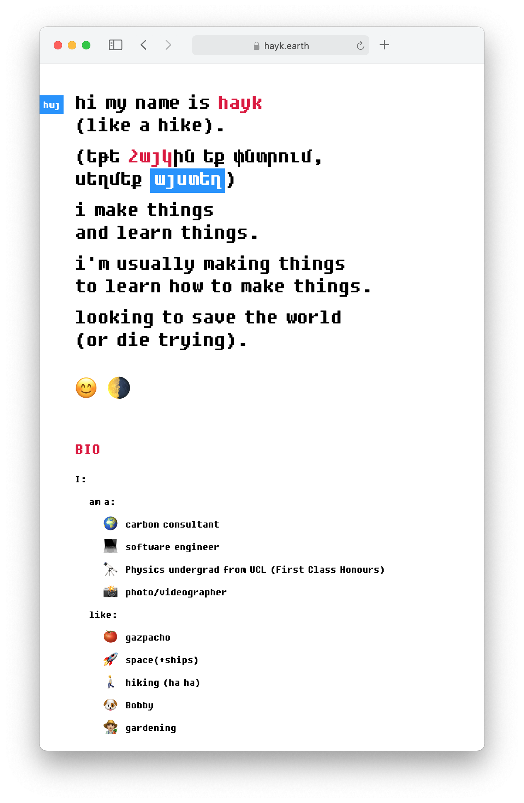

# hayk.io



### Requirements
* gulp

### Installation

```sh
$ cd hayk.io/
```

```sh
$ npm install
```

### Gulps

#### Development
```sh
$ gulp
```
* Builds files from `/src/` to `/tmp`
* Injects CSS & JS into HTML
* Serves `/tmp/` to port 3000 with livereload

#### Production
```sh
$ gulp build
```
* Builds files from `/src/` to `/`
* Injects CSS & JS into HTML

#### Cleaning up 
```sh
$ gulp clean
```
* Clears `/tmp/`

## Meta

Hayk Khachatryan – [chat w/ me](https://chat.hayk.io) – hi@hayk.io

[https://github.com/haykkh/](https://github.com/haykkh/)

## Contributing

1. Fork it (<https://github.com/haykkh/hayk.io/fork>)
2. Create your feature branch (`git checkout -b feature/fooBar`)
3. Commit your changes (`git commit -am 'Add some fooBar'`)
4. Push to the branch (`git push origin feature/fooBar`)
5. Create a new Pull Request